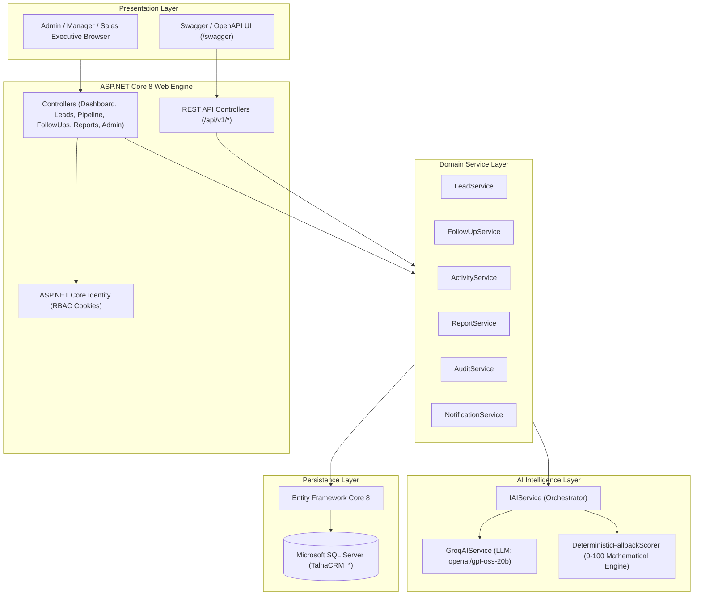
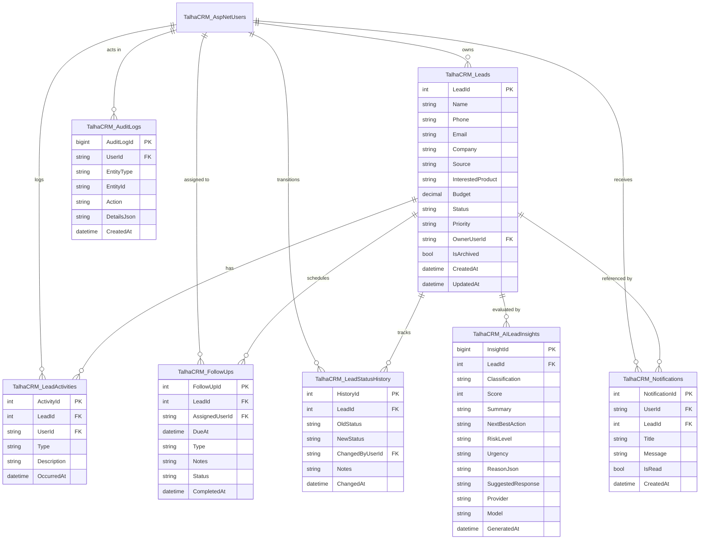

# System Architecture & Database ER Diagrams

## 1. High-Level Layered Architecture

```mermaid
flowchart TD
    subgraph Client["Presentation Layer"]
        A["Admin / Manager / Sales Executive Browser"]
        Swagger["Swagger / OpenAPI UI (/swagger)"]
    end

    subgraph MVC["ASP.NET Core 8 Web Engine"]
        Controllers["Controllers (Dashboard, Leads, Pipeline, FollowUps, Reports, Admin)"]
        ApiControllers["REST API Controllers (/api/v1/*)"]
        Auth["ASP.NET Core Identity (RBAC Cookies)"]
    end

    subgraph CoreServices["Domain Service Layer"]
        LeadSvc["LeadService"]
        FollowUpSvc["FollowUpService"]
        ActSvc["ActivityService"]
        RepSvc["ReportService"]
        AuditSvc["AuditService"]
        NotifSvc["NotificationService"]
    end

    subgraph AIEngine["AI Intelligence Layer"]
        IAI["IAIService (Orchestrator)"]
        Groq["GroqAIService (LLM: openai/gpt-oss-20b)"]
        Fallback["DeterministicFallbackScorer (0-100 Mathematical Engine)"]
    end

    subgraph Data["Persistence Layer"]
        EF["Entity Framework Core 8"]
        DB[("Microsoft SQL Server (TalhaCRM_*)")]
    end

    Client --> Controllers
    Swagger --> ApiControllers
    Controllers --> CoreServices
    ApiControllers --> CoreServices
    Controllers --> Auth
    CoreServices --> IAI
    IAI --> Groq
    IAI --> Fallback
    CoreServices --> EF
    EF --> DB
```

---

## 2. Entity-Relationship Diagram (ERD)

```mermaid
erDiagram
    TalhaCRM_AspNetUsers ||--o{ TalhaCRM_Leads : "owns"
    TalhaCRM_AspNetUsers ||--o{ TalhaCRM_LeadActivities : "logs"
    TalhaCRM_AspNetUsers ||--o{ TalhaCRM_FollowUps : "assigned to"
    TalhaCRM_AspNetUsers ||--o{ TalhaCRM_LeadStatusHistory : "transitions"
    TalhaCRM_AspNetUsers ||--o{ TalhaCRM_Notifications : "receives"
    TalhaCRM_AspNetUsers ||--o{ TalhaCRM_AuditLogs : "acts in"

    TalhaCRM_Leads ||--o{ TalhaCRM_LeadActivities : "has"
    TalhaCRM_Leads ||--o{ TalhaCRM_FollowUps : "schedules"
    TalhaCRM_Leads ||--o{ TalhaCRM_LeadStatusHistory : "tracks"
    TalhaCRM_Leads ||--o{ TalhaCRM_AILeadInsights : "evaluated by"
    TalhaCRM_Leads ||--o{ TalhaCRM_Notifications : "referenced by"

    TalhaCRM_Leads {
        int LeadId PK
        string Name
        string Phone
        string Email
        string Company
        string Source
        string InterestedProduct
        decimal Budget
        string Status
        string Priority
        string OwnerUserId FK
        bool IsArchived
        datetime CreatedAt
        datetime UpdatedAt
    }

    TalhaCRM_LeadActivities {
        int ActivityId PK
        int LeadId FK
        string UserId FK
        string Type
        string Description
        datetime OccurredAt
    }

    TalhaCRM_FollowUps {
        int FollowUpId PK
        int LeadId FK
        string AssignedUserId FK
        datetime DueAt
        string Type
        string Notes
        string Status
        datetime CompletedAt
    }

    TalhaCRM_LeadStatusHistory {
        int HistoryId PK
        int LeadId FK
        string OldStatus
        string NewStatus
        string ChangedByUserId FK
        string Notes
        datetime ChangedAt
    }

    TalhaCRM_AILeadInsights {
        bigint InsightId PK
        int LeadId FK
        string Classification
        int Score
        string Summary
        string NextBestAction
        string RiskLevel
        string Urgency
        string ReasonJson
        string SuggestedResponse
        string Provider
        string Model
        datetime GeneratedAt
    }

    TalhaCRM_Notifications {
        int NotificationId PK
        string UserId FK
        int LeadId FK
        string Title
        string Message
        bool IsRead
        datetime CreatedAt
    }

    TalhaCRM_AuditLogs {
        bigint AuditLogId PK
        string UserId FK
        string EntityType
        string EntityId
        string Action
        string DetailsJson
        datetime CreatedAt
    }
```
